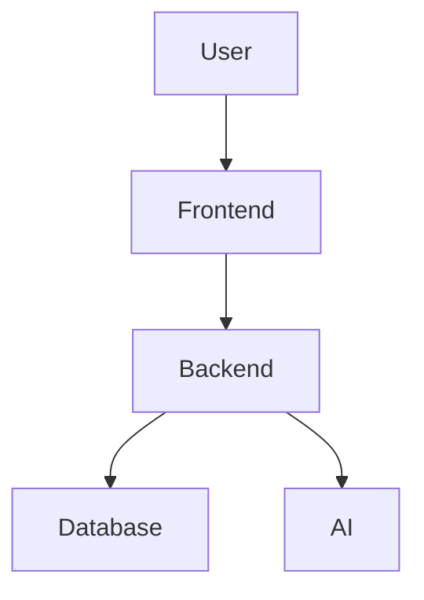

# Project Name

> Short one-line description of the project.


---

# Overview

Describe what the project does and why it exists.

## Features

- Fast and scalable
- AI-powered
- Secure authentication
- REST API support
- Mobile responsive
- Cloud deployment ready

---

# Architecture



---

# Screenshots


---

# Tech Stack

| Layer | Technology |
|---|---|
| Frontend | React / HTML / CSS |
| Backend | FastAPI / Node.js |
| Database | PostgreSQL / MongoDB |
| AI | OpenAI / Local LLM |
| Blockchain | Solidity / Web3 |
| Deployment | Docker / Render |

---

# Installation

## Clone Repository

```bash
git clone https://github.com/web4application/kubuverse.git
cd kubu
```

## Install Dependencies

```bash
npm install
```

or

```bash
pip install -r requirements.txt
```

---

# Configuration

 > Create a `.env` file:

```env
API_KEY=your_key_here
DATABASE_URL=your_database_url
SECRET_KEY=your_secret
```

---

# Running the Project

## Development

```bash
npm run dev
```

## Production

```bash
npm start
```

---

# API Endpoints

| Method | Endpoint | Description |
|---|---|---|
| GET | `/api/status` | Health check |
| POST | `/api/login` | User login |
| POST | `/api/chat` | AI chat |

---

# Folder Structure

```text
project/
├── frontend/
├── backend/
├── docs/
├── assets/
├── contracts/
├── tests/
└── README.md
```

---

# Deployment

## Docker

```bash
docker build -t kubu .
docker run -p 8000:8000 project
```

## Render

- Connect GitHub repository
- Add environment variables
- Deploy

---

# Security

- JWT authentication
- HTTPS support
- Rate limiting
- Input validation

---

# Roadmap

- [x] Core system
- [x] Authentication
- [ ] AI integration
- [ ] Mobile app
- [ ] Blockchain support

---

# Contributing

Pull requests are welcome.

## Steps

1. Fork repository
2. Create feature branch
3. Commit changes
4. Push branch
5. Open Pull Request

---

# License

MIT License

---

# Author

Your Name

- GitHub: https://kubu.github.io
- Website: https://127.0.0.1:0000

---

# Support

If you find this project useful:

⭐ Star the repository  
🐛 Report bugs  
💡 Suggest features
