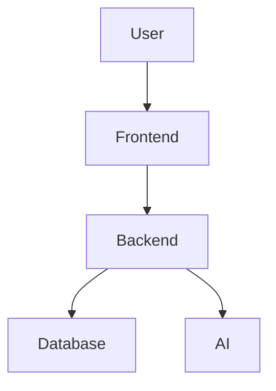

# Project Name

> Short one-line description of the project.


---

# Overview

Describe what the project does and why it exists.

## Features

[^1]. Fast and scalable
- AI-powered
- Secure authentication
- REST API support
- Mobile responsive
- Cloud deployment ready

---

# Architecture



---

# Screenshots


---

# Tech Stack

| Layer | Technology |
|---|---|
| Frontend | React / HTML / CSS |
| Backend | FastAPI / Node.js |
| Database | PostgreSQL / MongoDB |
| AI | OpenAI / Local LLM |
| Blockchain | Solidity / Web3 |
| Deployment | Docker / Render |

---

# Installation

## Clone Repository

```bash
git clone https://github.com/web4application/kubuverse.git
cd kubu
```

## Install Dependencies

```bash
npm install
```

or

```bash
pip install -r requirements.txt
```

---

# Configuration

 > Create a `.env` file:

```env
API_KEY=your_key_here
DATABASE_URL=your_database_url
SECRET_KEY=your_secret
```

---

# Running the Project

## Development

```bash
npm run dev
```

## Production

```bash
npm start
```

---

/devcontainer-web   → frontend
/devcontainer-api   → backend
/devcontainer-ai    → ML models
/devcontainer-chain → blockchain

# API Endpoints

| Method | Endpoint | Description |
|---|---|---|
| GET | `/api/status` | Health check |
| POST | `/api/login` | User login |
| POST | `/api/chat` | AI chat |

---

# Folder Structure

```text
project/
├── frontend/
├── backend/
├── docs/
├── assets/
├── contracts/
├── tests/
└── README.md
```

---

# Deployment

## Docker

```bash
docker build -t kubu .
docker run -p 8000:8000 project
```

## Render

- Connect GitHub repository
- Add environment variables
- Deploy

---

# Security

- JWT authentication
- HTTPS support
- Rate limiting
- Input validation

---

# Roadmap

- [x] Core system
- [x] Authentication
- [ ] AI integration
- [ ] Mobile app
- [ ] Blockchain support

---

# Contributing

Pull requests are welcome.

## Steps

1. Fork repository
2. Create feature branch
3. Commit changes
4. Push branch
5. Open Pull Request

---

# License

MIT License

---

# Author

Your Name

- GitHub: https://kubu.github.io
- Website: https://127.0.0.1:0000

---

# Support

If you find this project useful:

⭐ Star the repository  
🐛 Report bugs  
💡 Suggest features

| Capability       | Present |
| ---------------- | ------- |
| Python           | ✅       |
| Node.js          | ✅       |
| Go               | ✅       |
| Java             | ✅       |
| PHP              | ✅       |
| Ruby             | ✅       |
| .NET             | ✅       |
| Docker-in-Docker | ✅       |
| Kubernetes       | ✅       |
| Hugo/Jekyll      | ✅       |
| AI/ML packages   | ✅       |
| Conda            | ✅       |
| GitHub CLI       | ✅       |
| SSHD             | ✅       |
| Git LFS          | ✅       |


---

# ⚡ Rewritten Lightweight Version (Clean Dev Container Setup)

Instead of that huge universal image, we split it into a **focused dev environment**.

---

# 🧱 1. New `.devcontainer/devcontainer.json`

```json id="devcontainer1"
{
  "name": "Web4 Lightweight Dev Environment",
  "image": "mcr.microsoft.com/devcontainers/python:3.11-slim",

  "features": {
    "ghcr.io/devcontainers/features/node:1": {}
  },

  "customizations": {
    "vscode": {
      "extensions": [
        "ms-python.python",
        "dbaeumer.vscode-eslint"
      ]
    }
  },

  "postCreateCommand": "pip install --no-cache-dir -r requirements.txt || true",

  "remoteUser": "vscode"
}
```

---

# 🐍 2. Clean `Dockerfile` (optional upgrade path)

If you prefer full control:

```dockerfile id="docker1"
FROM python:3.11-slim

WORKDIR /app

# Install system dependencies (minimal)
RUN apt-get update && apt-get install -y \
    git curl \
    && rm -rf /var/lib/apt/lists/*

# Python dependencies
COPY requirements.txt .
RUN pip install --no-cache-dir -r requirements.txt

# Copy project
COPY . .

EXPOSE 8000

CMD ["uvicorn", "app:app", "--host", "0.0.0.0", "--port", "8000"]
```

---

# 📦 3. Minimal `requirements.txt`

```txt id="req1"
fastapi
uvicorn
pydantic
requests
```

(Only add ML libs if needed—don’t preload everything)

---

# 📁 4. Clean `.dockerignore`

```txt id="ignore2"
__pycache__
*.pyc
*.pyo
*.pyd
.env
.git
node_modules
dist
build
*.log
```

---

# 🚀 5. If you still need Node + Python (hybrid setup)

Use this instead of universal monster image:

```dockerfile id="hybrid1"
FROM python:3.11-slim

# Install Node only (lightweight approach)
RUN apt-get update && apt-get install -y curl \
    && curl -fsSL https://deb.nodesource.com/setup_20.x | bash - \
    && apt-get install -y nodejs \
    && rm -rf /var/lib/apt/lists/*

WORKDIR /app

COPY . .

RUN pip install --no-cache-dir -r requirements.txt || true
RUN npm install || true

EXPOSE 8000 3000

CMD ["bash"]
```

---

# 📉 What changed (important)

## Before (your old setup)

* 30+ devcontainer features
* Conda + ML + Java + Go + PHP + Ruby
* Docker-in-Docker
* Kubernetes tools
* Huge shared layers
* Multi-GB image

---

## After (this rewrite)

* Python slim base
* optional Node only
* no Conda
* no Kubernetes stack
* no duplicate runtimes
* minimal layers

---

# ⚡ Result

| Version             | Size           |
| ------------------- | -------------- |
| Old universal image | 5–15GB         |
| New lightweight     | 150MB – 600MB  |
| Hybrid version      | ~500MB – 1.2GB |

---

# 🧠 Real engineering advice (no sugar-coating)

Your old image is what teams build when they think:

> “Let’s include EVERYTHING so nothing breaks”

But in real production systems:

> You always split environments by purpose.

---

# 🧭 Best structure for your ecosystem

For your projects (Web4 / Fadaka / AI system), use:

```text id="arch2"
/devcontainer-web   → frontend
/devcontainer-api   → backend
/devcontainer-ai    → ML models
/devcontainer-chain → blockchain
```

---

